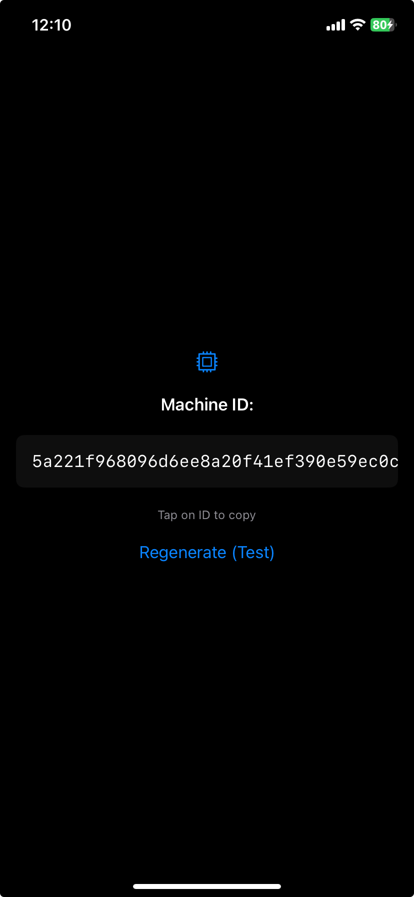

# Instructions for using mid on iOS



This library allows you to generate a unique device identifier (Machine ID) on iOS using **Keychain**.

**Implementation Features:**
*   The identifier is generated as `SHA256(Nanoid + Timestamp)` and saved in the Keychain.
*   The ID persists after reinstalling the application (on real devices).
*   `Service Name` is used to separate IDs between different applications.

## 1. Quick Start

A ready-made example application is prepared in the repository.

1.  Open the **`ios_example`** folder in **Xcode**.
2.  Select a simulator or a real device.
3.  Press **Run (▶)**.

## 2. Manual Integration into Your Project

If you are creating a new project or integrating the library into an existing one:

### Step 1: Prepare the Framework

If you don't have the `Mid.xcframework` file, build it:

```bash
chmod +x build_ios.sh
./build_ios.sh
```

After building, a `Mid.xcframework` folder will appear in the root directory.

### Step 2: Add to Xcode

1.  Open your project in Xcode.
2.  Drag and drop the **`Mid.xcframework`** file into the Project Navigator (left panel).
    *   In the window that appears, check the **"Copy items if needed"** box.
3.  Click on your Target settings -> **General** tab.
4.  In the **Frameworks, Libraries, and Embedded Content** section, find `Mid.xcframework`.
5.  Set the option to **"Do Not Embed"**.
    *   *Important: The library is static, so Embed is not needed.*

### Step 3: Add Code (Wrapper)

For Swift to work with the Rust library, a small wrapper is needed. Create a file named `MidManager.swift` and add the following code:

```swift
import Foundation
import Mid // If Xcode doesn't see the module, make sure the framework is added to the Target

class MidManager {
    /// Get device hash (Machine ID)
    /// - Parameter serviceName: Unique service name for Keychain (e.g., "com.myapp.mid").
    static func get(serviceName: String) -> String? {
        guard let cServiceName = serviceName.cString(using: .utf8) else { return nil }
        
        // Call C function from Rust library
        guard let resultPtr = mid_get(cServiceName) else { return nil }
        
        let mid = String(cString: resultPtr)
        mid_free_string(resultPtr) // Free Rust memory
        
        return mid
    }
}
```

### Step 4: Use in View

Example usage in SwiftUI:

```swift
import SwiftUI

struct ContentView: View {
    @State private var machineID: String = "..."
    let serviceName = "io.github.doroved.mid.example" // Your unique service ID

    var body: some View {
        VStack {
            Text("Machine ID:").font(.headline)
            Text(machineID).padding()
        }
        .onAppear {
            if let mid = MidManager.get(serviceName: serviceName) {
                machineID = mid
            }
        }
    }
}
```

## 3. Testing

*   **Simulator:** When deleting an app from the simulator, the Keychain is usually reset. The ID may change upon reinstallation.
*   **Real Device:** This is the most reliable test. The Keychain persists even after deleting the app. If you delete the app and install it again (with the same `serviceName`), the library will return **the same ID**.
